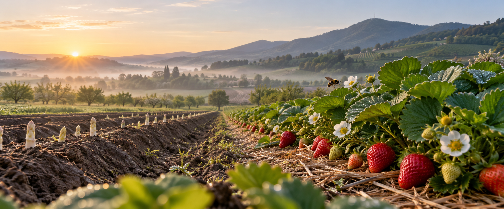

# Wendel — інформаційна архітектура, wireframes і visual direction

Дата: 1 жовтня 2026 року  
Статус: концепція для затвердження

## 1. Цілі сайту

Пріоритети сформовані навколо реальної поведінки відвідувачів:

1. швидко знайти найближчу відкриту точку продажу;
2. дізнатися, що зараз у сезоні та чи відкриті Hofladen, Café і Selbstpflücken;
3. зрозуміти якість, походження та спосіб вирощування продукції;
4. спланувати сімейний візит на ферму;
5. подати заявку на сезонну або постійну роботу.

Основні аудиторії:

- локальні покупці та люди по маршруту сезонних Verkaufsstände;
- сім'ї, які планують самозбір або відвідування Hof-Café;
- покупці, для яких важливі регіональність, якість і сталість;
- кандидати на сезонні та постійні вакансії;
- партнери, преса та організатори групових візитів.

## 2. Sitemap

Архітектура навмисно пласка: будь-яка важлива сторінка доступна максимум за два переходи.

```text
Startseite (/)
├── Produkte (/produkte)
│   ├── Spargel (/produkte/spargel)
│   ├── Erdbeeren (/produkte/erdbeeren)
│   ├── Himbeeren (/produkte/himbeeren)
│   └── Hofprodukte (/produkte/hofprodukte)
├── Verkaufsstellen (/verkaufsstellen)
│   └── Verkaufsstelle detail (/verkaufsstellen/{standort})
├── Hof erleben (/hof-erleben)
│   ├── Hofladen (/hof-erleben/hofladen)
│   ├── Hof-Café (/hof-erleben/hof-cafe)
│   ├── Selbstpflücken (/hof-erleben/selbstpfluecken)
│   ├── Spielplatz (/hof-erleben/spielplatz)
│   └── Hofführung (/hof-erleben/hoffuehrung)
├── Nachhaltigkeit (/nachhaltigkeit)
│   ├── Anbau & Nützlinge (/nachhaltigkeit/anbau-nuetzlinge)
│   ├── Folie & Recycling (/nachhaltigkeit/folie-recycling)
│   ├── Energie & Wasser (/nachhaltigkeit/energie-wasser)
│   └── Verpackung (/nachhaltigkeit/verpackung)
├── Über uns (/ueber-uns)
│   ├── Familie & Geschichte (/ueber-uns/geschichte)
│   ├── Team (/ueber-uns/team)
│   └── Qualität & Zertifikate (/ueber-uns/qualitaet)
├── Aktuelles (/aktuelles)
│   └── Beitrag (/aktuelles/{slug})
├── Jobs (/jobs)
│   └── Stelle (/jobs/{slug})
├── Kontakt (/kontakt)
├── Impressum (/impressum)
├── Datenschutz (/datenschutz)
└── Cookie-Einstellungen (/cookie-einstellungen)
```

### Redirect plan для наявних ключових URL

| Старий URL | Новий URL |
|---|---|
| `/unsere-produkte/` | `/produkte` |
| `/spargel-aus-zwingenberg/` | `/produkte/spargel` |
| `/sonnengereifte-erdbeeren/` | `/produkte/erdbeeren` |
| `/aromatische-himbeeren/` | `/produkte/himbeeren` |
| `/verkauf-hofladen-hof-cafe/` | `/hof-erleben` |
| `/verkauf-hofladen-hof-cafe/#selbst` | `/hof-erleben/selbstpfluecken` |
| `/nachhaltigkeit-umweltschutz/` | `/nachhaltigkeit` |
| `/das-unternehmen/` | `/ueber-uns` |
| `/stellenangebote-jobs/` | `/jobs` |
| `/news/` | `/aktuelles` |

Усі інші публічні URL перед міграцією потрібно отримати з CMS/XML sitemap і додати до повної таблиці 301 redirects.

## 3. Навігація

### Desktop header

- логотип;
- Produkte;
- Verkaufsstellen;
- Hof erleben;
- Nachhaltigkeit;
- Über uns;
- Aktuelles;
- CTA **Stand finden**.

Jobs і Kontakt залишаються в utility navigation та footer. Header стає компактним після першого екрану. CTA завжди показує не абстрактне «Mehr erfahren», а конкретну дію.

### Mobile navigation

Унизу екрана — постійна action bar:

- **Stand finden**;
- **Heute**;
- **Anrufen**.

Меню містить усі розділи, але найчастіші сезонні задачі не ховаються у hamburger.

### Сезонний статус

Єдиний компонент використовується в Hero, header, Verkaufsstellen і Selbstpflücken:

- `Geöffnet` — зелений;
- `Heute geschlossen` — нейтральний;
- `Saison startet bald` — світлий жовтий;
- `Saison beendet` — спокійний синьо-зелений;
- `Selbstpflücken heute möglich` — полуничний червоний.

Статус повинен мати текст та іконку, а не передаватися лише кольором.

## 4. Desktop wireframe головної

```text
┌──────────────────────────────────────────────────────────────────────────┐
│ Logo   Produkte  Verkaufsstellen  Hof erleben  Nachhaltigkeit  Über uns │
│                                                        [Stand finden]    │
├──────────────────────────────────────────────────────────────────────────┤
│ [Saison beendet / Nächster Start]                                        │
│                                                                          │
│ Frisch gewachsen.                    кінематографічне поле,               │
│ Nah genossen.                        горизонт і продукція                 │
│                                                                          │
│ Spargel, Erdbeeren und Himbeeren von der Bergstraße.                     │
│ [Verkaufsstand finden] [Hof erleben]                                     │
│                                                   scroll cue: Feldlinie  │
├──────────────────────────────────────────────────────────────────────────┤
│ HEUTE BEI WENDEL — функціональна сезонна стрічка                         │
│ Hofladen: —  Café: —  Selbstpflücken: —  [Alle Zeiten]                  │
├──────────────────────────────────────────────────────────────────────────┤
│ Unsere Ernte                                                             │
│                                                                          │
│  SPARGEL                         ERDBEEREN                     HIMBEEREN   │
│  великий вертикальний кадр       широкий макро-кадр            кадр       │
│  короткий факт + Saison          короткий факт + Saison        факт       │
├──────────────────────────────────────────────────────────────────────────┤
│ VOM FELD ZU IHNEN — sticky scroll scene                                  │
│                                                                          │
│ ┌──────────────────────┐   ┌───────────────────────────────────────────┐ │
│ │ Spargel              │   │                                           │ │
│ │ Erdbeere  ●          │   │  рослина змінюється відповідно до scroll  │ │
│ │ Himbeere             │   │  земля → цвітіння → плід → збір → продукт │ │
│ │                      │   │                                           │ │
│ │ 03 Blüte             │   │                                           │ │
│ │ Hummeln bestäuben... │   └───────────────────────────────────────────┘ │
│ └──────────────────────┘                                                 │
├──────────────────────────────────────────────────────────────────────────┤
│ Hof erleben                                                              │
│                                                                          │
│ [Hofladen + Café, великий кадр]  [Selbstpflücken]  [Spielplatz]          │
│                                  [Hofführung]                             │
├──────────────────────────────────────────────────────────────────────────┤
│ Verantwortung, die mitwächst                                             │
│ 440 kW Solar │ Folie bis 7 Jahre │ 100% recycelbare Obstschalen          │
│ інтерактивна лінія: сонце → вода → комаха → рослина → упаковка           │
├──────────────────────────────────────────────────────────────────────────┤
│ Seit 1986. Familie Wendel.                                               │
│ [архівний/сімейний кадр]       коротка історія + [Über uns]              │
├──────────────────────────────────────────────────────────────────────────┤
│ Aktuelles — 3 актуальні картки без дублювання всього тексту              │
├──────────────────────────────────────────────────────────────────────────┤
│ Besuchen Sie uns                                                         │
│ адреса + графік + карта + маршрут + контакт                              │
├──────────────────────────────────────────────────────────────────────────┤
│ Footer: продукти │ Hof erleben │ Unternehmen │ Service │ legal           │
└──────────────────────────────────────────────────────────────────────────┘
```

## 5. Mobile wireframe

```text
┌──────────────────────────┐
│ Logo              [Menu] │
├──────────────────────────┤
│ [Saison beendet]         │
│                          │
│ Frisch gewachsen.        │
│ Nah genossen.            │
│                          │
│ [Hero crop: ягода/поле]  │
│                          │
│ [Stand finden]           │
├──────────────────────────┤
│ Heute bei Wendel         │
│ Hofladen        —        │
│ Café            —        │
│ Selbstpflücken  —        │
├──────────────────────────┤
│ Unsere Ernte             │
│ [swipe: 3 культури]      │
├──────────────────────────┤
│ Vom Feld zu Ihnen        │
│ [Spargel|Erdbeere|Himb.] │
│                          │
│ [одна активна сцена]     │
│ 03 — Blüte               │
│ текст                    │
│ [progress line]          │
├──────────────────────────┤
│ Hof erleben              │
│ [Hofladen + Café]        │
│ [Selbstpflücken]         │
│ [Spielplatz]             │
├──────────────────────────┤
│ Nachhaltigkeit / Familie │
│ Aktuelles / Kontakt      │
├──────────────────────────┤
│ [Stand] [Heute] [Anruf]  │ ← fixed bottom action bar
└──────────────────────────┘
```

На мобільному scroll-story не фіксує екран надовго: кожен свайп або короткий scroll змінює одну сцену. Це зменшує втому й не блокує природний скрол сторінки.

## 6. Visual direction: «Field Journal, not Farmhouse»

### Чому саме так

Типовий «фермерський» дизайн швидко стає кліше: кремовий фон, декоративний рукописний шрифт, дерев'яні текстури, зелені rounded cards. Wendel потребує правдивішої мови — сучасного польового журналу, де краса походить із геометрії гребенів, макрофотографії, сезонних даних і реальної ручної праці.

Один сміливий елемент — анімована жива культура в центральній scroll-story. Решта інтерфейсу спокійна, точна й функціональна.

### Palette

| Token | Колір | Роль |
|---|---:|---|
| `soil-950` | `#261C16` | основний текст, земля, footer |
| `field-800` | `#24462F` | бренд-зелений, header, CTA |
| `leaf-500` | `#668A54` | вторинний зелений, статуси |
| `berry-600` | `#B92335` | полуничний акцент і термінові сезонні дії |
| `asparagus-200` | `#DCE3B0` | м'які секції та product state |
| `sky-100` | `#E8EEF0` | прохолодний нейтральний фон |
| `paper-50` | `#F8F6F0` | основний фон без жовтого «крафтового» відтінку |

Акцент `berry-600` використовується рідко: стиглий плід, статус самозбору, одна важлива дія. Він не стає універсальним кольором кнопок.

### Typography

- Display: **Newsreader Variable** — природна, редакційна антиква з німецьким характером без «luxury fashion» манірності.
- UI/body: **Instrument Sans Variable** — компактний сучасний гротеск для графіків, навігації та довгих текстів.
- Великі заголовки: 72–104 px desktop, 46–58 px mobile, щільний line-height.
- Основний текст: 18–20 px, максимум 68–72 символи в рядку.
- Не використовувати all-caps eyebrows над кожним заголовком. Малі службові підписи — sentence case.

### Grid і композиція

- 12 колонок desktop, 4 mobile;
- текст переважно вирівняний ліворуч;
- великі фото навмисно виходять за стандартний content column;
- горизонтальні лінії повторюють ряди поля й використовуються як progress indicator;
- border-radius не універсальний: фотографії можуть мати природну асиметричну маску, функціональні елементи — 6–10 px;
- картки використовуються лише для реальних незалежних сутностей: точки продажу, новини, вакансії.

### Motion principles

- рух завжди пояснює процес або стан;
- одна головна orchestrated scroll-story замість reveal-анімації на кожній секції;
- траєкторія джмеля з'єднує цвітіння та формування плоду;
- product tabs змінюють колір, фактуру та стадії, але не перебудовують layout;
- `prefers-reduced-motion` отримує послідовність статичних кадрів без втрати змісту;
- анімація завантажується після критичного Hero й не погіршує LCP.

## 7. Moodboard asset

Файл: `public/images/concepts/wendel-hero-art-direction-v1.png`



Цей кадр фіксує бажані світло, глибину, природні фактури та поєднання культур. Це moodboard, а не фінальна фотографія: для production слід точніше відтворити реальний Melibokus, уникнути одночасного показу неприродно ідеальних фаз урожаю й підтвердити агрономічну коректність кожної сцени.

Промпт генерації збережений у `docs/image-prompts.md`.

## 8. Компоненти для першого UI-прототипу

1. `SeasonStatus`;
2. `Header` + mobile action bar;
3. `Hero`;
4. `StandFinderQuickSearch`;
5. `HarvestProductPanel`;
6. `CropStory` і `CropStoryStep`;
7. `FarmExperienceGrid`;
8. `SustainabilityProof`;
9. `NewsCard`;
10. `VisitPanel`;
11. `Footer`;
12. cookie preferences, focus states, empty/error/loading states.

## 9. Контент, який потрібно підтвердити до production

- точний сезонний графік і правила його оновлення;
- джерело даних для Verkaufsstände та їхніх щоденних статусів;
- чи доступна оплата карткою для кожної точки;
- актуальні дати Selbstpflücken;
- повний асортимент Hofladen і меню Hof-Café;
- які продукти виробляє сам Wendel, а які є партнерськими;
- актуальні сертифікати та право використання логотипів;
- реальні фотографії родини, команди, полів і упаковки;
- юридичні тексти, consent categories і аналітика;
- мови сайту: німецька як основна; окремо вирішити потребу в польській та румунській для Jobs.

